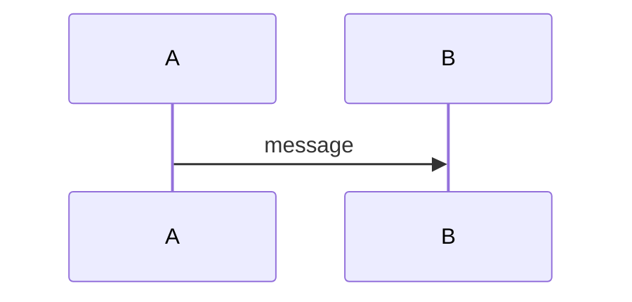

# PR template — the five load-bearing sections

Every PR on `julianken/bird-sight-system` **must** follow `.github/PULL_REQUEST_TEMPLATE.md`. GitHub applies the template automatically to PRs created through the UI. When you use `gh pr create --body`, paste the template body verbatim and fill every section — GitHub does not inject the template on API-created PRs.

Skipping sections is not a style preference. Each section is load-bearing for a specific downstream consumer (the bot, the reviewer, the merge queue, or the traceability chain). Missing sections force `@julianken-bot` to round-trip with a `REQUEST_CHANGES`, which costs review cycles and wall-clock time.

## The five sections

### 1. Diagrams



**Load-bearing because:** the diagram is the primary comprehension surface for `@julianken-bot`. The bot's review prompt explicitly leads with the diagram — if present, the bot grasps architectural shape in one pass and can spend its token budget on the diff. If absent, the bot has to reconstruct the intent from the code, which is slower and more error-prone. For PRs that genuinely cannot be diagrammed (one-line typo, dependency bump, comment-only doc edit), replace the block with `N/A — <reason>`.

Good diagram shapes: data flows, sequence diagrams, state machines, component trees, migration graphs, infra topology. Multiple diagrams are encouraged when the PR spans layers.

### 2. Summary

1–3 bullets supporting the diagram. Lead with the *why* — the diagram shows the *what*. Commit messages follow the same rule (`## Commits` in CLAUDE.md).

**Load-bearing because:** short, bulleted, why-first summaries are the shape the bot's review prompt expects. Long prose summaries cause the bot to spend tokens parsing instead of reviewing.

### 3. Screenshots

**REQUIRED on any PR that touches `frontend/**`.** Otherwise: `N/A — not UI`.

Per the UI verification protocol in CLAUDE.md's Testing section:

1. Run `npm run dev --workspace @bird-watch/frontend`.
2. Drive every touched surface via `mcp__plugin_playwright_playwright__browser_*`.
3. Resize to at least mobile (390×844) and desktop (1440×900) — the two viewports the release-1 exit criteria name.
4. `browser_console_messages` must return zero errors AND zero warnings.
5. `browser_take_screenshot` per viewport per surface.
6. Commit screenshots under `docs/screenshots/plan<N>/task<M>-<slug>/<description>.png`.
7. Reference them in the PR body via **absolute** `raw.githubusercontent.com` URLs with the commit SHA — relative paths do not resolve in PR bodies.

**Load-bearing because:** passing e2e + `npm run build` is necessary but not sufficient. Those checks miss console warnings, viewport-specific layout breaks, and interactions that only surface under real use. The Playwright MCP drive catches them. The Screenshots section is the evidence the implementer actually ran the drive — without it, the reviewer has to re-run the check from scratch, doubling the review cost.

Exceptions: test-only, type-only, and comment-only PRs under `frontend/**` use `N/A — not UI` even if they touch the directory.

### 4. Test plan

A checklist of verifications run. Reviewers expect all boxes checked on a ready-to-merge PR. Standard checklist items:

- `npm run typecheck && npm run test` — green
- New unit / integration tests added (if behavior changed)
- New Playwright e2e spec added (if user-visible behavior changed)
- `npm run build` — clean production build
- (UI only) Playwright MCP smoke — per the Screenshots protocol above

**Load-bearing because:** the four required CI checks (`test`, `lint`, `build`, `e2e`) are necessary but not comprehensive. The test plan surfaces things CI cannot catch — manual verification of UX edge cases, DB migration rollback tests, smoke tests against staging. Reviewers use the checklist as the closing audit before approving.

### 5. Plan reference

Either:

```
Part of Plan <N>, Task <M>. See `docs/plans/<plan-file>.md`.
```

…or, for out-of-plan work:

```
Out of plan — <one-line reason>
```

**Load-bearing because:** this repo runs `superpowers:subagent-driven-development` with plans as the primary unit of work. The Plan reference is the bi-directional traceability link — it lets the reviewer jump from the PR to the plan task and confirm the PR implements exactly that task (no scope creep, no skipped prereqs). For out-of-plan work, the one-line reason is the justification trail (e.g. "incident response — hotfix for bird-maps.com CDN misconfiguration").

## Tripwire summary

- Every section is mandatory. Use `N/A — <reason>` where the section genuinely does not apply. Never delete a section header.
- `Screenshots: N/A — not UI` is allowed only for non-`frontend/**` PRs (or test-only/type-only/comment-only changes within `frontend/**`).
- `Plan reference` must either link a plan file or say `Out of plan — <reason>`. Blank is not acceptable.
- When using `gh pr create --body "$(cat <<'EOF' … EOF)"`, paste the template body verbatim. Do not strip sections to save tokens.
