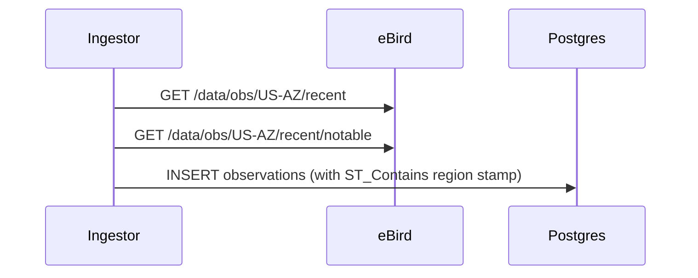

## Diagrams

<!-- PRIMARY comprehension surface. Reviewers should be able to grasp the full
change from the diagram(s) alone — Summary and code diff are supporting context,
not the primary explanation. Replace the example below with your own diagram(s).
Good shapes: data flows, sequence diagrams, state machines, component trees,
migration graphs, infra topology. Multiple diagrams are encouraged when the PR
spans layers. If the change genuinely cannot be diagrammed (one-line typo, dep
bump, comment-only), delete the block and write: N/A — <reason> -->

## Summary

<!-- 1–3 bullets supporting the diagram(s) above. Lead with the *why* — the
diagram shows the *what*. -->

-
-

## Screenshots

<!-- REQUIRED when this PR adds or modifies visible UI (any file under
frontend/**). Otherwise write "N/A — not UI".

Upload screenshots via the user-attachments paste flow (skill:
`~/.claude/skills/pr-screenshots-via-user-attachments/`). This produces
`user-attachments/assets/<uuid>` URLs that are CDN-hosted, repo-independent,
and survive branch deletion. Do NOT commit PNGs to the repo and do NOT use
`raw.githubusercontent.com` URLs. -->

## Test plan

<!-- Checklist of the verifications you ran. Reviewers expect all boxes checked
on a ready-to-merge PR. -->

- [ ] `npm run typecheck && npm run test` — green
- [ ] New unit / integration tests added (if behavior changed)
- [ ] New Playwright e2e spec added (if user-visible behavior changed)
- [ ] `npm run build` — clean production build
- [ ] (UI only) Playwright MCP smoke — ran `npm run dev --workspace
      @bird-watch/frontend`, drove the feature via
      `mcp__plugin_playwright_playwright__browser_*` at ≥1 mobile (390×844) and
      ≥1 desktop (1440×900) viewport, `browser_console_messages` returns no
      errors/warnings, and the Screenshots section was captured from those
      runs. Human-authored PRs may substitute direct browser interaction.
      Reviewers repeat the drive + console check via `gh pr checkout <N>` +
      `npm run dev` against the PR head SHA before approving.

## Plan reference

<!-- Link the execution plan and task this PR implements. For out-of-plan work,
write "Out of plan — <one-line reason>". -->

Part of Plan <N>, Task <M>. See `docs/plans/<plan-file>.md`.

---

🤖 Generated with [Claude Code](https://claude.com/claude-code)
