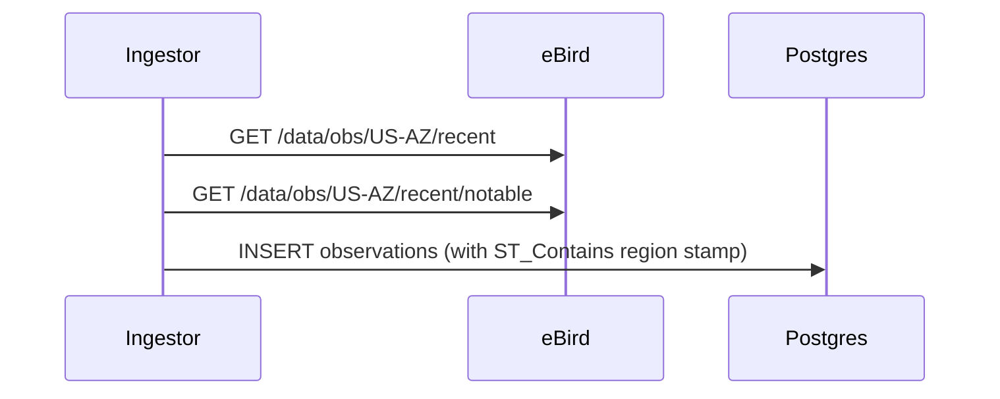

## Diagrams

<!-- PRIMARY comprehension surface. Reviewers should be able to grasp the full
change from the diagram(s) alone — Summary and code diff are supporting context,
not the primary explanation.

Use ```mermaid fenced blocks (GitHub renders them inline). Good shapes: data
flows, sequence diagrams, state machines, component trees, migration graphs,
infra topology. Multiple diagrams are encouraged when the PR spans layers.

If the change genuinely cannot be diagrammed (one-line typo, dep bump,
comment-only), write: N/A — <reason>


-->

## Summary

<!-- 1–3 bullets supporting the diagram(s) above. Lead with the *why* — the
diagram shows the *what*. -->

-
-

## Screenshots

<!-- REQUIRED when this PR adds or modifies visible UI (any file under
services/frontend/**). Otherwise write "N/A — not UI".

Headless workflow for subagent-generated PRs: capture via Playwright in the
task's e2e spec, save under docs/screenshots/plan<N>/task<M>-<slug>/<description>.png,
commit with the PR, then reference the file using an ABSOLUTE raw.githubusercontent
URL with the commit SHA captured at PR-creation time. Relative paths do NOT work
in PR bodies — GitHub resolves them against /pull/N/, not the repo root.

Pattern (inside a subagent bash HEREDOC):

    SHA=$(git rev-parse HEAD)
    gh pr create --body "...  ..."

Human-authored PRs can drag-and-drop the image directly into the comment box —
GitHub uploads it and inserts a working link. -->

## Test plan

<!-- Checklist of the verifications you ran. Reviewers expect all boxes checked
on a ready-to-merge PR. -->

- [ ] `npm run typecheck && npm run test` — green
- [ ] New unit / integration tests added (if behavior changed)
- [ ] New Playwright e2e spec added (if user-visible behavior changed)
- [ ] `npm run build` — clean production build
- [ ] (UI only) Manual smoke via `npm run dev` — feature works in the browser

## Plan reference

<!-- Link the execution plan and task this PR implements. For out-of-plan work,
write "Out of plan — <one-line reason>". -->

Part of Plan <N>, Task <M>. See `docs/plans/<plan-file>.md`.

---

🤖 Generated with [Claude Code](https://claude.com/claude-code)
