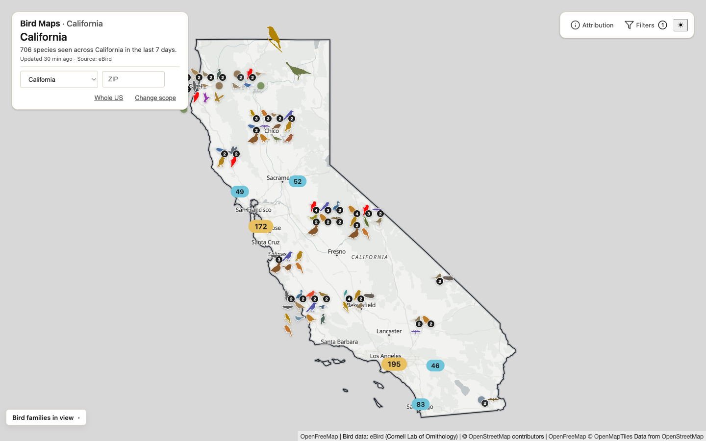
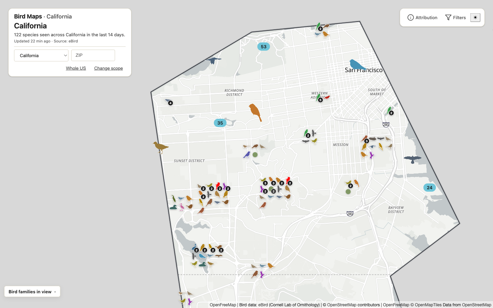
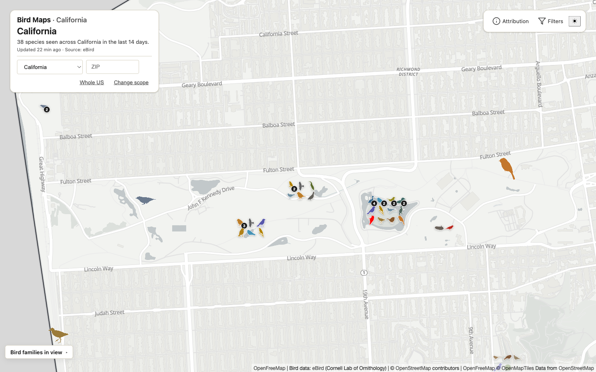

# Bird Maps

Recent bird sightings across the United States, on a real-geographic map. Pick a
state or ZIP and see what's been spotted in the last two weeks — every sighting
coloured and shaped by bird family. Live at **[bird-maps.com](https://bird-maps.com)**.

<table>
  <tr>
    <td width="33%"></td>
    <td width="33%"></td>
    <td width="33%"></td>
  </tr>
  <tr>
    <td align="center"><sub><b>Statewide</b> — California</sub></td>
    <td align="center"><sub><b>City</b> — San Francisco</sub></td>
    <td align="center"><sub><b>Neighborhood</b> — Golden Gate Park</sub></td>
  </tr>
</table>

## What it is

A single-page map over the [eBird](https://ebird.org) observation feed — the map
*is* the interface, with no tabs, feed, or dashboard. Choose a scope (a state, a
ZIP, or the whole country) and recent sightings render in place: aggregated counts
when you're zoomed out, individual family-coloured markers when you're zoomed in.

## Why it's built this way

- **One always-mounted map, nothing to navigate into** — the map owns the screen and the controls float in its four corners; there's no nav bar and no second view.
- **The server clusters, not the browser** — the API returns zoom-aware aggregated buckets at low zoom and clips to the chosen state with a PostGIS `ST_Intersects` query, so a national point set never lands in the client all at once.
- **Bird family is the visual key** — each observation is coloured and shaped by family (silhouettes from [PhyloPic](https://www.phylopic.org)), so the map reads at a glance instead of as a wall of identical pins.
- **Geography lives in the URL** — the selected state is in the URL, so every view is a shareable link; a ZIP resolves to its state through a vendored Census index, no server round-trip.
- **Cheap to run** — the services scale to zero on Cloud Run; the only always-on cost is a small Postgres instance behind a billing cap.

## Getting started

```bash
npm install
npm run db:up        # local Postgres + PostGIS via Docker
npm run db:migrate
npm run db:seed      # ~400 sample sightings so the map isn't empty
npm run dev --workspace @bird-watch/frontend
```

To also run the API the map reads from, see [`services/read-api/README.md`](services/read-api/README.md).

`db:seed` writes a deterministic, idempotent spread of ~400 observations across
~24 bird families and ~20 states — enough to render a realistic map without an
eBird API key. (Migrations only seed reference data: family silhouettes, state
boundaries, and a small species set; real sightings otherwise come from a live
eBird ingest.) Re-run it any time; it reads `DATABASE_URL` and defaults to the
local Docker database.

## Architecture

```
frontend/    React + Vite + MapLibre map        → Cloudflare Pages
services/
  read-api/  Hono HTTP API the map reads from    → Cloud Run
  ingestor/  scheduled eBird ingest + enrichment → Cloud Run Jobs
  admin-api/ operator-only silhouette overrides  → Cloud Run
packages/    shared db-client + TypeScript types
infra/       Terraform (GCP + Cloudflare) + edge Workers
```

The ingestor pulls from eBird on a schedule and upserts observations into Cloud SQL
Postgres (PostGIS), enriched with PhyloPic silhouettes and iNaturalist / Wikipedia
species detail. The frontend reads everything through the cached Read API behind
Cloudflare. Design rationale:
[`docs/specs/2026-04-16-bird-watch-design.md`](docs/specs/2026-04-16-bird-watch-design.md).

## Tech stack

| Layer | Technology |
|---|---|
| Frontend | React 18 · Vite · MapLibre GL JS |
| API | Hono on Node |
| Data | Cloud SQL Postgres 16 + PostGIS |
| Infra | GCP Cloud Run · Cloudflare (Pages, R2, Workers) · Terraform |
| Sources | eBird · PhyloPic · iNaturalist · Wikipedia |

## Documentation

- [`services/read-api/README.md`](services/read-api/README.md) — the public read API
- [`services/ingestor/README.md`](services/ingestor/README.md) — ingest kinds and schedules
- [`services/admin-api/README.md`](services/admin-api/README.md) — operator silhouette overrides
- [`infra/README.md`](infra/README.md) — Terraform and deployment
- [`SECURITY.md`](SECURITY.md) — vulnerability disclosure

## License

MIT — see [LICENSE](./LICENSE).
