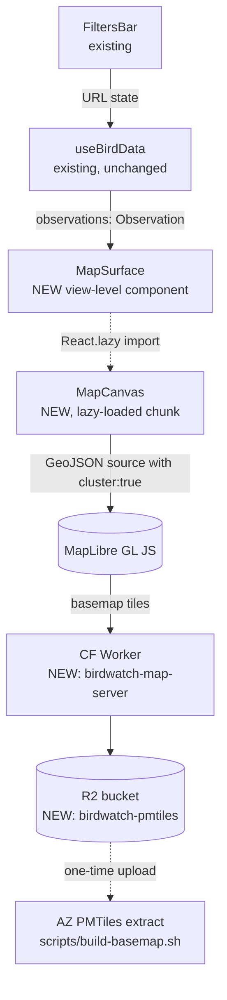

# Map v1 — Real Geographic Map Surface (Plan 7)

> **Status: OBSOLETE — never applied.** The map at https://bird-maps.com serves all tiles from `tiles.openfreemap.org` (see `frontend/src/components/map/basemap-style.ts`). The Cloudflare infrastructure declared in this plan (R2 pmtiles bucket, `tiles.bird-maps.com` DNS record, `map-server` Worker, `map_tiles` route) was added to `infra/terraform/map-v1.tf` but never `terraform apply`'d. The TF file was removed on 2026-05-03 in PR #390 to clear the drift before the allowlist expiry. See issue #385 for the investigation. Do not execute this plan; preserved as historical record.

> **For agentic workers:** REQUIRED SUB-SKILL: Use `superpowers:subagent-driven-development` (recommended) or `superpowers:executing-plans` to implement this plan task-by-task. Execution is split across four GitHub sub-issues (S1–S4) tracked by a map-v1 epic. Pick up one sub-issue at a time via the `agent-ready` label; each carries its own acceptance criteria. The prototype gate in `CLAUDE.md` is mandatory — do not start S2/S3/S4 until the learnings note from S1 is committed.

Tracks GitHub issue **#152** (`feat(frontend): add geographic map surface showing bird distribution (map-v1)`). Resolves the core user ask: "I want to have a map that really shows the distribution of birds in that time period and where."

## Context

bird-maps.com shipped to production 2026-04-19 without a map, despite the original spec calling for one. The first attempt (Plan 4, SVG ecoregion map) was scrapped during Plan 6's reimagine — the root-cause analysis (`docs/analyses/2026-04-20-frontend-map-analysis/phase-4/analysis-report.md`) attributes the failure to three compounding choices: ecoregion taxonomy as the UX frame, SVG polygons as the rendering target, and a from-scratch implementation. Mobile 390×844 was where it fell apart (badges shrank to near-unclickable, label collision on expand, Sky Islands rendered as a grey blank).

This plan adds a map surface that avoids each of those failure modes: real geographic basemap (PMTiles vector tiles, not abstract ecoregions), an industry-standard WebGL renderer (MapLibre GL JS, not hand-rolled SVG), and a single clustered-point layer (not polygon choropleths that the prior analysis ruled out as UX-misleading).

CLAUDE.md declares a **mandatory prototype gate** before any plan body touches code. This file is the post-prototype plan. If the prototype has not yet been built, do that first per the procedure in `CLAUDE.md` §"Prototype gate" and commit a 5-line learnings note before proceeding.

## Decisions (locked in during brainstorm 2026-04-22)

| # | Question | Answer |
|---|----------|--------|
| 1 | Primary question the map answers | "Where are the recent sightings?" — observation points, collapsed with Q3's density answer into one layer |
| 2 | Density / distribution layer | **Clustered points only.** MapLibre source-level `cluster: true`. No heatmap. No choropleth. Clusters *are* the density signal. |
| 3 | Basemap tile source | **Self-hosted PMTiles on Cloudflare R2**, served by a small CF Worker. No token, no rate limit, no external SLA. |
| 4 | Nav placement | **Replace the Hotspots tab with a Map tab.** Three tabs total: Feed / Species / Map. Old `?view=hotspots` silently redirects to `?view=map`. |
| 5 | Fate of the current hotspot list | **Deleted from the UI.** `/api/hotspots` stays on the wire (hotspots fetch in `useBirdData` preserved, unused — cheap insurance for a v2 hotspot-marker layer). |

Ecoregions are explicitly rejected as a UI primitive (Julian's direct words: "the eco-regions are not what we should focus on — they don't work well for a UI at all"). The existing `regions.geom` / `ST_AsGeoJSON` conversation from #152 becomes moot: no region polygons are served or rendered.

## Architecture

### Rendering library — JSX via react-map-gl

All MapLibre wiring lives inside React components using **`react-map-gl@^8.1.1`** (`<Map>`, `<Source>`, `<Layer>`). No imperative `map.addSource` / `map.addLayer` calls. `maplibre-gl@^5.24.0` ships as a peer dependency. This is the single rendering path — don't mix imperative MapLibre with the JSX API; the tests at `MapCanvas.test.tsx` assert on `<Source>` prop shape, which is the react-map-gl convention.

### Layers (all expressed as react-map-gl JSX)

- **`<Source id="observations" type="geojson" data={...} cluster clusterMaxZoom={14} clusterRadius={50}>`** — GeoJSON feature collection built from the already-fetched `Observation[]`.
- **`<Layer id="clusters" type="circle" filter={['has', 'point_count']} paint={...} />`** — cluster bubble; paint size/color by `point_count`.
- **`<Layer id="cluster-count" type="symbol" filter={['has', 'point_count']} layout={...} />`** — cluster count label; text from `point_count`.
- **`<Layer id="unclustered-point" type="circle" filter={['!', ['has', 'point_count']]} paint={...} />`** — individual observation dot; paint color by `isNotable`.

### Lazy-loading boundary

`MapSurface.tsx` does `const MapCanvas = React.lazy(() => import('./map/MapCanvas'))`. MapLibre's ~210 KB gz bundle hits only users who open the Map tab. The Feed and Species tabs remain unaffected.

## File changes

### Frontend — new files

| Path | Purpose |
|------|---------|
| `frontend/src/components/MapSurface.tsx` | View-level. Wraps `React.lazy()` import of `MapCanvas`. Renders Suspense skeleton + ErrorBoundary. |
| `frontend/src/components/map/MapCanvas.tsx` | MapLibre instance, source/layer setup, popover state. Lazy-loaded. |
| `frontend/src/components/map/observation-layers.ts` | Pure helpers: GeoJSON source builder, MapLibre layer specs. Unit-testable without a DOM. |
| `frontend/src/components/map/ObservationPopover.tsx` | Inline popover on individual point click: common name, location, time, notable flag. No navigation. |
| `frontend/src/components/map/basemap-style.ts` | MapLibre style spec pointing at the CF Worker tile endpoint. |

### Frontend — changed files

| Path | Change | Current line ref |
|------|--------|-------------------|
| `frontend/src/state/url-state.ts` | `view` union: replace `'hotspots'` with `'map'`. Add `?view=hotspots` → `?view=map` compatibility shim in the parser (same place as the view-sniff at lines 39–46). | L39–46, L60 |
| `frontend/src/components/SurfaceNav.tsx` | Rename third tab from `Hotspots` to `Map`. Tab uses accessible-name pattern `Map view` to match the existing Playwright selector convention. | L23–25 (TABS const) |
| `frontend/src/App.tsx` | Swap `state.view === 'hotspots' && <HotspotListSurface/>` for `state.view === 'map' && <MapSurface/>`. | L78–83 |
| `frontend/src/data/use-bird-data.ts` | No change. Hotspots fetch preserved for possible v2 marker layer. |

### Frontend — deleted

| Path | Rationale |
|------|-----------|
| `frontend/src/components/HotspotListSurface.tsx` | Replaced by `MapSurface`. |
| `frontend/src/styles.css` — `.hotspot-*` block | Dead CSS. |
| Any children-only-used by `HotspotListSurface` | Sweep after removal. |

### Frontend — tests

| Path | Change |
|------|--------|
| `frontend/src/components/map/observation-layers.test.ts` | NEW. Pure vitest: GeoJSON shape assertions for N observations, `isNotable` → paint expression. |
| `frontend/src/components/map/MapCanvas.test.tsx` | NEW. Mount with canned observations; assert source-data prop shape passed to `react-map-gl`. Don't assert WebGL rendering. |
| `frontend/e2e/happy-path.spec.ts` | Rewrite the `Hotspots view` tab assertion to `Map view`. Selector pattern `getByRole('tab', { name: '${name} view' })` at `:47,:95` stays. |
| `frontend/e2e/map.spec.ts` | NEW. Navigate, wait for canvas, assert cluster click + filter round-trip + `?view=hotspots` redirect. |

### Infra — new file

`infra/terraform/map-v1.tf` — follows the `frontend.tf` pattern (~87 lines of existing reference shape). Contains:

- `resource "cloudflare_r2_bucket" "pmtiles"` — `name = "birdwatch-pmtiles"`, location EU/WNAM per existing convention.
- `resource "cloudflare_worker_script" "map_server"` — name `birdwatch-map-server`, R2 binding to `birdwatch-pmtiles`, inline script (~30 lines) that fetches `{z}/{x}/{y}.pbf`, sets `Content-Type: application/vnd.mapbox-vector-tile`, `Cache-Control: public, max-age=31536000, immutable`, CORS.
- `resource "cloudflare_worker_route"` — attach to `tiles.bird-maps.com/*` (new DNS record in the same file mirroring `frontend.tf` DNS).

Cloudflare provider is already pinned at `~> 4.20` in `versions.tf`. No new provider, no new version bump.

### Infra — new script

`scripts/build-basemap.sh` — one-time, committed for reproducibility, **not run in CI**. Downloads an Arizona OSM extract (via e.g. Protomaps or Geofabrik), runs `pmtiles extract` to an AZ bounding box, uploads to R2 with `wrangler r2 object put`. Idempotent.

## Reuse from existing code

- `useBirdData` (`frontend/src/data/use-bird-data.ts`) — untouched. Map subscribes to the same `observations` array the Feed uses.
- `FiltersBar` (`frontend/src/components/FiltersBar.tsx`) — untouched. Filter changes automatically propagate via URL state.
- `ApiClient` (`frontend/src/api/client.ts`) — untouched. Map doesn't make any new API calls.
- `ErrorBoundary` pattern and loading-skeleton components from existing surfaces — reuse wholesale.

## Prototype gate (MANDATORY before any implementation)

Per `CLAUDE.md` §"Prototype gate", no code under this plan may be written until all of:

- [x] Canned JSON with **≥344 representative observations** drives a local MapLibre prototype. (PR #163)
- [x] Rendering verified at **390×844 AND 1440×900** (the two viewports the release-1 exit criteria name). (PR #163)
- [x] Every interactive surface exercised: pan, zoom, cluster click, individual point click, filter-change repaint. (PR #163)
- [x] **Zero console errors, zero console warnings** at both viewports. (PR #163)
- [x] 5-line learnings note committed to `docs/plans/2026-04-22-map-v1-prototype/learnings.md` documenting anything that surprised the prototyper. (PR #163)

The prototype does NOT need a real API, real R2 tiles, or real auth. A local Vite dev server with canned JSON and OpenFreeMap tiles is sufficient for the gate itself — we swap in the R2-hosted PMTiles during implementation. Scope: 2–4 hours.

## Implementation phases (post-prototype)

1. **Infra.** Provision R2 bucket + Worker + DNS. Run `build-basemap.sh` once. Verify `curl https://tiles.bird-maps.com/0/0/0.pbf` returns bytes.
2. **Frontend scaffolding.** Add `MapSurface`, `MapCanvas`, pure helpers. TDD: start with `observation-layers.test.ts`, then mount MapCanvas with canned data.
3. **URL-state swap.** `view` union change + `?view=hotspots` redirect. TDD: append redirect-shim test cases to the existing `frontend/src/state/url-state.test.ts` (confirmed present at HEAD, 2026-04-22).
4. **Surface nav rename.** `SurfaceNav.tsx` label + `App.tsx` branch swap.
5. **Deletion.** Remove `HotspotListSurface.tsx` and CSS. Run `npm run test` + `npm run build`; fix any dangling imports.
6. **E2E.** Rewrite `happy-path.spec.ts` tab assertions. Add `map.spec.ts` for the map-specific flows.
7. **Playwright MCP drive** at both viewports per `CLAUDE.md` §"UI verification". Capture screenshots for the PR body.

## Context7 fetches the implementer must run

- `maplibre-gl` — API shape churns between majors; both packages have crossed major-version boundaries since this plan was written. Consult context7 before re-executing. Current pins: `react-map-gl@^8.1.1`, `maplibre-gl@^5.24.0` (verify against `frontend/package.json` before starting).
- `react-map-gl` — v8 has a different component API than v7. Pin-read before importing.
- `cloudflare/cloudflare` Terraform provider — resources `cloudflare_r2_bucket`, `cloudflare_worker_script`, `cloudflare_worker_route` already listed in CLAUDE.md's drift-prone table.

No new entry is needed in `CLAUDE.md`'s context7 table for MapLibre — but the implementer should propose one as part of the same PR, since this plan introduces the dependency.

## Dependencies on other in-flight work

- **Issue #151** (replace sidebar with dedicated detail surface) — **independent.** Map-v1 point click uses an inline popover, NOT the detail surface. If #151 lands first, v2 can add a "See detail" link in the popover. If #151 lands after, no change needed here.
- **Issue #153** (release-2 polish sweep) — independent. Map-v1 introduces no new instances of the bugs called out there (the implementer should avoid reintroducing them — e.g., don't use `ApiClient`'s raw `error.message` in any new error screen).

## Verification

End-to-end test checklist for the PR reviewer:

- [ ] `npm run typecheck && npm run test --workspace @bird-watch/frontend` — green.
- [ ] `npm run build --workspace @bird-watch/frontend` — clean production build; verify the Map chunk is a separate file via `ls frontend/dist/assets/` (should show a `MapCanvas-*.js` chunk distinct from the main bundle).
- [ ] `npm run dev --workspace @bird-watch/frontend` + Playwright MCP at both viewports: no console errors, no console warnings, observations render as clustered markers, filter changes repaint, cluster click zooms, point click opens popover, `?view=hotspots` silently redirects to `?view=map`.
- [ ] `npm run test:e2e --workspace @bird-watch/frontend` — `happy-path.spec.ts` and new `map.spec.ts` green.
- [ ] Terraform plan in `infra/terraform/` shows only the three new resources + DNS record. No unexpected diffs.
- [ ] `curl -I https://tiles.bird-maps.com/0/0/0.pbf` returns 200 + `Content-Type: application/vnd.mapbox-vector-tile` + `Cache-Control: public, max-age=31536000, immutable`.
- [ ] Lighthouse (or `chrome-devtools:debug-optimize-lcp`) at 390×844 on the Feed tab: LCP not regressed by more than 50 ms — the map chunk should not affect non-map pages.
- [ ] PR description follows `.github/PULL_REQUEST_TEMPLATE.md` with all five sections, mandatory Screenshots at both viewports, Mergify queue comment exactly `@Mergifyio queue` (per CLAUDE.md).

## Out of scope for v1 (explicitly parked)

- Hotspot-centroid marker layer (`/api/hotspots` data is still on the wire; revisit as v2 if users miss the "named place" concept).
- Heatmap / kernel density overlay.
- Drawing tools or custom user polygons.
- Deep-link from point click to a species detail surface (couples with #151; v2).
- Real-time animation over time.
- deck.gl or any layer library beyond what MapLibre ships with.
- Clustering-parameter tuning beyond MapLibre defaults.
- Server-side region aggregation (`ST_AsGeoJSON` on `/api/regions`) — not rendered; no endpoint change.
- A "Reset view" or "Fit to results" button — deferred to v2 if requested.

## Critical files — quick-scan list

- `frontend/src/state/url-state.ts` (L39–46, L60)
- `frontend/src/App.tsx` (L78–83 surface-branch swap)
- `frontend/src/components/SurfaceNav.tsx` (L23–25)
- `frontend/src/components/HotspotListSurface.tsx` (delete)
- `frontend/src/data/use-bird-data.ts` (leave alone; verify hotspots fetch still runs)
- `frontend/e2e/happy-path.spec.ts` (L47, L95 tab selectors)
- `infra/terraform/versions.tf` (cloudflare `~> 4.20` — no bump)
- `infra/terraform/frontend.tf` (reference pattern for new `map-v1.tf`)
- `docs/analyses/2026-04-20-frontend-map-analysis/phase-4/analysis-report.md` (prior-art rationale; read before implementing)
- `CLAUDE.md` §"Prototype gate" and §"Use context7 for these libraries"
